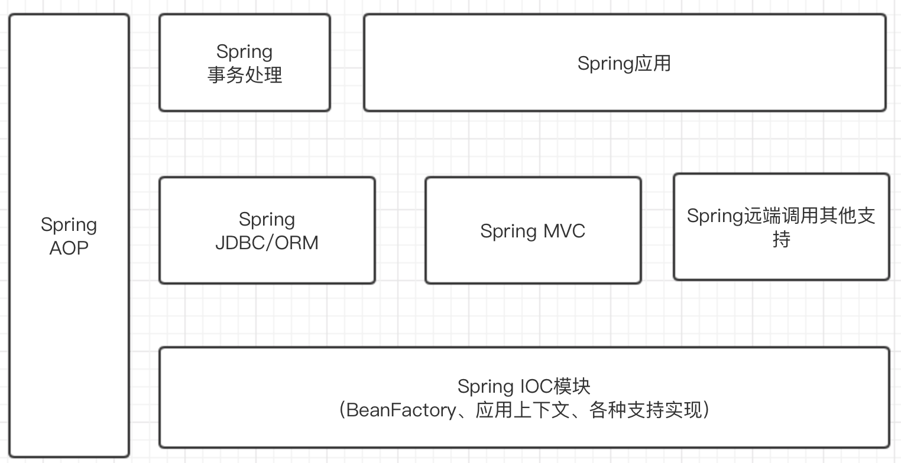
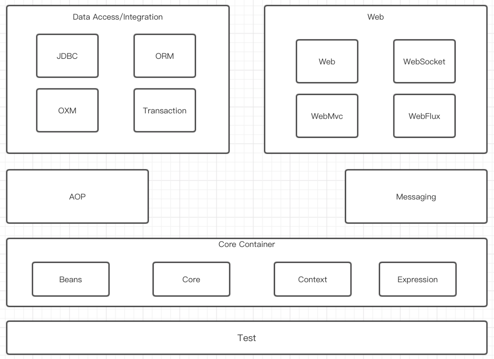

# 框架
## 什么是（软件）框架
- 维基百科：软件框架，通常指的是为了实现某个业界标准或完成特定基本任务的软件组件规范，也指为了实现某个软件组件规范时，提供规范所要求之基础功能的软件产品
- 框架就是制定一套规范或者规则（思想），大家（程序员）在该规范或者规则（思想）下工作。或者说就是使用别人搭好的舞台，来做表演
- 框架的特点
    - 半成品
    - 封装了特定的处理流程或控制逻辑
    - 成熟、不断升级改进的软件
- 框架与类库的区别
    - 框架一般是封装了逻辑、高内聚，类库则是松散的工具组合
    - 框架专注于某一领域，类库则是更通用的
## 为什么使用（软件）框架
- 软件系统日趋复杂
- 重用度高，开发效率和质量提高
- 软件设计人员要专注于对领域的了解，使需求分析更充分
- 易于上手、快速解决问题

# Spring的架构

# Spring的介绍
- Spring相关网站
    - [Spring官网](https://spring.io)
    - [Spring Framework](https://spring.io/projects/spring-framework)
- **Spring IoC**：包含了最为基本的IoC容器BeanFactory的接口与实现，也就是说，在这个Spring的核心包中，不仅定义了IoC容器的最基本接口（BeanFactory），也提供了一系列这个接口的实现，如XmlBeanFactory就是一个最基本的BeanFactory（IoC容器），从名字上可以看到，它能够支持通过XML文件配置的Bean定义信息。除此之外，Spring IoC容器还提供了一个容器系列，如SimpleJndiBeanFactory、StaticListableBeanFactory等。我们知道，单纯一个IoC容器对于应用开发来说是不够的，为了让应用更方便地使用IoC容器，还需要在IoC容器的外围提供其他的支持，这些支持包括Resource访问资源的抽象和定位等，所有的这些，都是这个Spring IoC模块的基本内容。另外，在BeanFactory接口实现中，除了前面介绍的像BeanFactory那样最为基本的容器形态之外，Spring还设计了IoC容器的高级形态ApplicationContext应用上下文供用户使用，这些ApplicationContext应用上下文，如FileSystemXmlApplicationContext、ClassPathXmlApplicationContext，对应用来说，是IoC容器中更面向框架的使用方式，同样，为了便于应用开发，像国际化的消息源和应用支持事件这些特性，也都在这个模块中配合IoC容器来实现，这些功能围绕着IoC基本容器和应用上下文的实现，构成了整个Spring IoC模块设计的主要内容。
- **Spring AOP**：这也是Spring的核心模块，围绕着AOP的增强功能，Spring集成了AspectJ作为AOP的一个特定实现，同时还在JVM动态代理/CGLIB的基础上，实现了一个AOP框架，作为Spring集成其他模块的工具，比如TransactionProxyFactoryBean声明式事务处理，就是通过AOP集成到Spring中的。在这个模块中，Spring AOP实现了一个完整的建立AOP代理对象，实现AOP拦截器，直至实现各种Advice通知的过程。在对这个模块的分析中可以看到，AOP模块的完整实现是我们熟悉AOP实现技术的一个不可多得的样本。
- **Spring MVC**：对于大多数企业应用而言，Web应用已经是一种普遍的软件发布方式，而在Web应用的设计中，MVC模式已经被广泛使用了。在Java的社区中，也有很多类似的MVC框架可以选择，而且这些框架往往和Web UI设计整合在一起，对于定位于提供整体平台解决方案的Spring，这样的整合也是不可缺少的。Spring MVC就是这样一个模块，这个模块以DispatcherServlet为核心，实现了MVC模式，包括怎样与Web容器环境的集成，Web请求的拦截、分发、处理和ModelAndView数据的返回，以及如何集成各种UI视图展现和数据表现，如PDF、Excel等，通过这个模块，可以完成Web的前端设计。
- **Spring JDBC/Spring ORM**：在企业应用中，对以关系数据库为基础的数据的处理是企业应用的一个重要方面，而对于关系数据库的处理，Java提供了JDBC来进行操作，但在实际的应用中，单纯使用JDBC的方式还是有些繁琐，所以在JDBC规范的基础上，Spring对JDBC做了一层封装，使通过JDBC完成的对数据库的操作更加简洁。Spring JDBC包提供了JdbcTemplate作为模板类，封装了基本的数据库操作方法，如数据的查询、更新等；另外，SpringJDBC还提供了RDBMS的操作对象，这些操作对象可以使应用以更面向对象的方法来使用JDBC，比如可以使用MappingSqlQuery将数据库数据记录直接映射到对象集合，类似一个极为简单的ORM工具。除了通过Spring JDBC对数据库进行操作外，Spring还提供了许多对ORM工具的封装，这些封装包括了常用的ORM工具，如Hibernate、iBatis等，这一层封装的作用是让应用更方便地使用这些ORM工具，而不是替代这些ORM工具，比如可以把对这些工具的使用和Spring提供的声明式事务处理结合起来。同时，Spring还提供了许多模板对象，如HibernateTemaplate这样的工具来实现对Hibernate的驱动，这些模板对象往往包装使用Hibernate的一些通用过程，比如Session的获取和关闭、事务处理的关联等，从而把一些通用的特性实现抽象到Spring中来，更充分地体现了Spring的平台作用。
- **Spring事务处理**：Spring事务处理是一个通过Spring AOP实现自身功能增强的典型模块。在这个模块中，Spring把在企业应用开发中事务处理的主要过程抽象出来，并且简洁地通过AOP的切面增强实现了声明式事务处理的功能。这个声明式事务处理的实现，使应用只需要在IoC容器中对事务属性进行配置即可完成，同时，这些事务处理的基本过程和具体的事务处理器实现是无关的，也就是说，应用可以选择不同的具体的事务处理机制，如JTA、JDBC、Hibernate等。因为使用了声明式事务处理，这些具体的事务处理机制被纳入Spring事务处理的统一框架中完成，并完成与具体业务代码的解耦。在这个模块中，可以看到一个通用的实现声明式事务处理的基本过程，比如怎样配置事务处理的拦截器，怎样读入事务配置属性，并结合这些事务配置属性对事务对象进行处理，包括事务的创建、挂起、提交、回滚等基本过程，还可以看到具体的事务处理器（如DataSourceTransactionManager、HibernateTransactionManager、JtaTransactionManager等）是怎样封装不同的事务处理机制（JDBC、Hibernate、JTA等）的。
- **Spring远端调用**：Spring为应用带来的一个好处就是能够将应用解耦。应用解耦，一方面可以降低设计的复杂性，另一方面，可以在解耦以后将应用模块分布式地部署，从而提高系统整体的性能。在后一种应用场景下，会用到Spring的远端调用，这种远端调用是通过Spring的封装从Spring应用到Spring应用之间的端到端调用。在这个过程中，通过Spring的封装，为应用屏蔽了各种通信和调用细节的实现，同时，通过这一层的封装，使应用可以通过选择各种不同的远端调用来实现，比如可以使用HTTP调用器（以HTTP协议为基础的），可以使用第三方的二进制通信实现Hessian/Burlap，甚至还封装了传统Java技术中的RMI调用。
- **Spring应用**：从严格意义上来说，这个模块不属于Spring的范围。这部分的应用支持，往往来自一些使用得非常广泛的Spring子项目，或者该子项目本身就可以看成是一个独立的Spring应用，比如为Spring处理安全问题的Spring ACEGI后来转化为Spring子项目的Spring Security OAuth等。这个Spring应用支持的部分还有一个重要的组成，那就是包括了其他的一些模块，这些模块提供了许多Spring应用与其他技术实现的相关接口，比如与各种J2EE实现规范的接口，对JMS、JNID、JMX、JavaMail等的支持，Spring应用和Flex前端的接口，Spring应用移植到OSGi平台上运行的接口。通过这个模块的支持，使Spring应用可以便利和简洁地容纳第三方的技术实现，不但丰富了Spring应用的功能，而且丰富了整个Spring生态圈，使Spring应用得越来越广泛

## 什么是Spring
- Spring是一个开源框架，为了解决企业应用开发的复杂性而创建，
- 是一个轻量级的控制反转（Ioc）和面向切面（AOP）的容器框架
    - 从大小与开销两方面而言Spring都是轻量的
    - 通过控制反转（Ioc）的技术达到送耦合的目的
    - 提供了面向切面编程的丰富支持，允许通过分离应用的业务逻辑与系统级服务进行内聚性的开发
    - 包含并管理应用对象的配置和生命周期，这个意义上是一种容器
    - 将简单的组件配置、组合成为复杂的应用，这个意义上是框架
- Spring是JavaSE/EE的一站式框架

## Spring作用
- 容器
- 提供了对多种技术的支持
    - JMS
    - MQ支持
    - UnitTest
    - ...
- AOP（事务管理、日志等）
- 提供了众多方便应用的辅助类（JDBC Template等）
- 对主流应用框架（Hibernate等）提供了良好的支持

## Spring的模块

1. 核心容器（Core Container）
    - spring-core：提供Spring框架的核心支持，包括各种工具与基本注解，大多数其他模块都需要引入核心模块
    - spring-beans：提供Spring框架对Bean生命周期相关的支持，包括BeanFactory等组件
    - spring-context：提供Spring上下文支持，包括ApplicationContext等组件
    - spring-expression：提供SpEL表达式支持
2. AOP
    - 为Spring提供面向切面编程的支持，包括ProxyFactory代理工程等组件
3. Web应用模块
    - spring-web：提供对Web应用的支持，用于Web容器整合Spring框架，如Tomcat等
    - spring-websocket：提供对WebSocket协议相关支持
    - spring-webmvc：提供MVC框架，与Spring框架无缝框架，并结合spring-web为基于Servlet容器的Web应用提供MVC支持
    - spring-webflux：为Spring提供基于Reactive响应式编程的Web框架。不同于spring-webmvc基于Servlet容器，spring-webflux一般基于Netty等异步网络框架，打破了原有Servlet的统治地位
4. 数据访问集成（Data Access/Integration）
    - spring-jdbc：提供对JDBC相关数据库操作的支持
    - spring-tx：提供对事务相关的支持
    - spring-orm：提供对对象关系映射的支持
    - spring-oxm：提供对对象XML实体映射的支持
5. Messaging
    - 为Spring提供各种消息队列支持，包括ActiveMQ、Kafka等消息组件支持的核心
6. Test
    - 提供Spring框架测试组件相关支持

## Spring的功能
Spring框架提供了IOC与AOP两大核心功能：
- 控制反转（Inversion of Control IOC）
- 面向切面编程（Aspect Oriented Programming AOP）

### 控制反转
控制反转有时也叫依赖注入（Dependency Injection DI）。其实依赖注入只是实现控制反转的一种方式，Spring框架实现控制反转使用的就是依赖注入，**通过依赖注入使得Java Bean的创建、引用、销毁的控制反转交给框架处理，使用方只需要声明需要依赖某个Java Bean，这个Bean就会被自动注入**，这也是控制反转的核心概念。

理解控制反转：

在没有控制反转之前，如果使用A类的功能时，又要依赖B类，还需把B类实例传递给A类或者在A类中直接创建B类实例。

当系统越来越复杂时，各个类之间的依赖关系可能并不是简单的线性关系，复杂度会倍增，此时如果没有清晰的依赖关系图，整个系统的启动将会非常复杂，也很容易出现问题。

有了控制反转之后，就是把各个类的管理控制权交给容器。当需要使用某个类时，容器会自动管理该类实例并交给使用方使用，管理策略：
- 如果容器中无此类实例，则自动创建实例并保存在容器中
- 如果已存在实例，则获取该实例

对于使用方而言，只需声明需要依赖的类即可被自动注入。

例如：当A类需要使用B类实例时，只需要在A类中声明需要B类，框架就会自动被B类实例注入到A类中，以此实现各个类之间的解耦，降低系统的复杂度。

生活例子：假如没有餐厅，想要吃饭就要自己准备材料自己做，每做一顿饭就要花大量的时间。后来有家餐厅，想要吃什么通过餐厅点餐即可，从而节省了从食材准备、烹饪及餐后打扫的时间，这样就有更多的时间来做更多的事。

控制反转的主要目的是为了：**实现各个模块之间的解耦，降低各模块的耦合度**。

### 面向切面编程
一般会把逻辑单元按照功能分为多个层，如控制层、服务层、数据操作层等，每个逻辑单元自身是按照面向过程和面向对象模式编写的，但是各个逻辑单元相互调用时，会出现一些公用的逻辑，需要在某一层的所有逻辑单元执行。

例如：需要在服务层的调用之前记录日志监控调用的情况。面向切面编程就是指对某一层进行纵切，在这一层的切面上添加各种公用逻辑，最终的目标是去除冗余的代码，达到逻辑复用的目的。

生活例子：一家餐厅，在处理的时候是手动门，每位进入餐厅的客人需要手推开门，离开时还需要手动拉门。后来进行一次升级，手动门改成了自动门，门会自动感应客人的进出并自动开关，客人感觉不到门的存在，带来了极大的便利。这就类似于面向切面的结构，客人和餐厅是两层逻辑单元，原本上层的客人要调用下层的餐厅都需要先执行开门动作，而在两层的切面门上加上自动机制，可以自动在两层调用之间加入统一的逻辑，大大简化了开发。

面向切面的主要目的是：**为某一层添加统一功能，减少代码的冗余**。

Spring中的Bean都基于普通的Java对象（Plan Ordinary Java Object，POJO）构建，为普通对象赋予了强大的功能，实现了轻量级和最小侵入性编程。