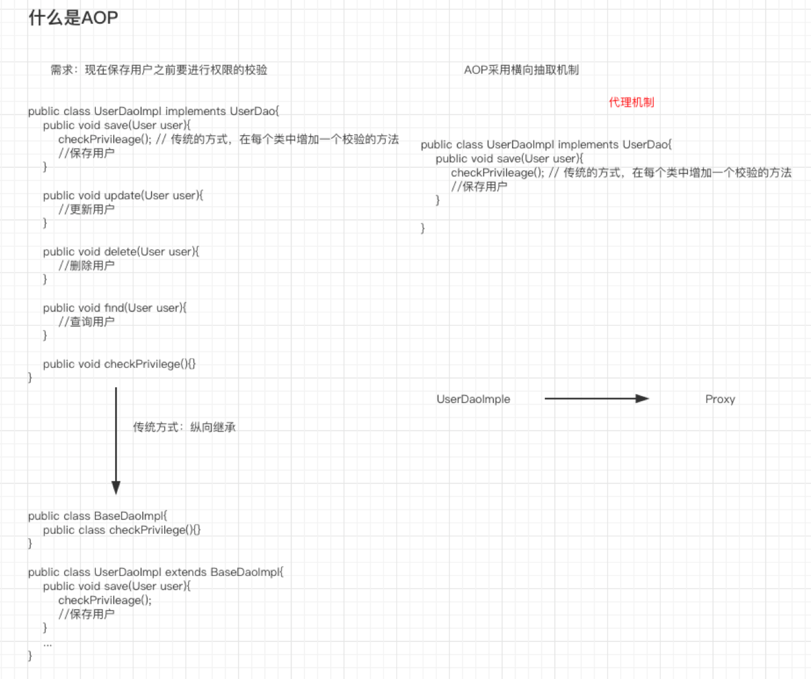
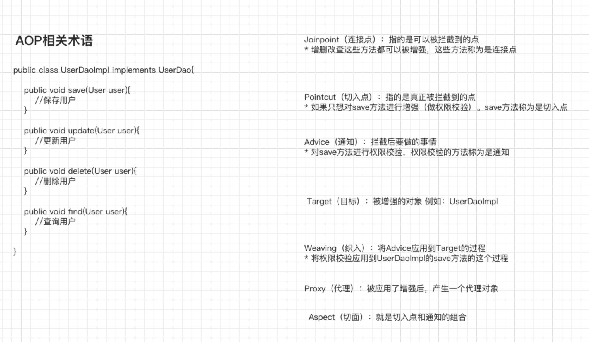

# AOP概述
## 什么是AOP
- AOP：Aspect Oriented Programming
- AOP采用横向抽取机制，取代了传统纵向继承体系重复性代码（性能监视、事务管理、安全检查、缓存）
- Spring AOP使用纯Java实现，不需要专门的编译过程和类加载器，在运行期通过代理方式向目标类织入增强代码


## AOP相关术语
- Joinpoint（连接点）：所谓连接点是指那些被拦截到的点。在Spring中，这些点指的是方法，因为spring只支持方法类型的连接点
- Pointcut（切入点）：所谓切入点是指我们要对那些Joinpoint进行拦截的定义
- Advice（通知/增强）：所谓通知是指拦截到Joinpoint之后所要的事情就是通知
    - **通知分为**前置通知，后置通知，异常通知，最终通知，环绕通知（切面要完成的功能） 
- Introduction（引介）：引介Hi一种特殊的通知在不修改类代码的前提下
    - Introduction可以在运行期为类动态地添加一些方法或Field
- Target（目标对象）：代理的目标对象
- Weaving（织入）：是指吧增强应用到目标对象来创建新的代理对象的过程。
    - spring采用动态代理织入，而AspectJ采用编译期织入和类装载期织入
- Proxy（代理）：一个类被AOP织入增强后，就产生一个结果代理类
- Aspect（切面）：是切入点和通知（引介）的结合


# AOP的底层实现
## JDK动态代理
jdk动态代理实现，见实例：package com.spring.example.aop.proxy.jdk;

只能对已实现接口的类进行代理
## 使用CGLIB生成代理
- 对于不使用接口的业务类，无法使用JDK动态代理
- CGlib采用非常底层字节码技术，可以为一个类创建子类，解决无接口代理问题

cglib动态代理实现，见实例：package com.spring.example.aop.proxy.cglib;

## 代理知识总结
- Spring在运行期间，生成动态代理对象，不需要特殊的编译器
- Spring AOP的底层就是通过JDK动态代理或CGLib动态代理技术为目标Bean执行横向织入
    - 若目标对象实现了若干接口，spring使用JDK的java.lang.reflect.Proxy类代理
    - 若目标对象没有实现任何接口，spring使用CGLib库生成目标对象的子类
- 程序中优先对接口创建代理，便于程序解耦维护
- 标记为final的方法，不能被代理， 因为无法进行覆盖
    - JDK动态代理，是针对接口生成子类，接口中方法不能使用final修饰
    - CGLib是针对目标类生产子类，因此类或方法不能使用final
- Spring只支持方法连接点，不提供属性连接点

# Spring的传统AOP
## Spring AOP增强（通知）类型
- AOP联盟为通知Advice定义了org.aopalliance.aop.Interface.Advice
- Spring安装通知Advice在目标类方法的连接点位置，可以分为5类
    - 前置通知：org.spring.framework.aop.MethodBeforeAdvice
        - 在目标方法执行前实施增强
    - 后置通知：org.springframework.aop.AfterReturningAdvice
        - 在目标方法执行后实施增强
    - 环绕通知：org.aopalliance.intercept.MethodInterceptor
        - 在目标方法执行前后实施增强
    - 异常抛出通知：org.springframework.aop.ThrowsAdvice
        - 在方法抛出异常后实施增强
    - 引介通知：org.springframework.aop.IntroductionInterceptor
        - 在目标类中添加一些新的方法和属性

## Spring AOP切面类型
- Advisor：代表一般切面，Advice本身就是一个切面，对目标类所有方法进行拦截
- PointcutAdvisor：代表具有切面点的切面，可以指定拦截目标类哪些方法
- IntroductionAdvisor：代表引介切面，针对引介通知而使用切面

## Advisor切面案例
需要引入的依赖
```
<dependency>
    <groupId>aopalliance</groupId>
    <artifactId>aopalliance</artifactId>
    <version>1.0</version>
</dependency>

<dependency>
    <groupId>org.springframework</groupId>
    <artifactId>spring-aop</artifactId>
    <version>${spring.version}</version>
</dependency>
```
### 不带切入点的切面（一般切面）
- ProxyFactoryBean常用可配置属性
    - target：代理的目标对象
    - proxyInterfaces：代理要实现的接口
        - 如果多个接口可以使用以下格式赋值
        ```
        <list>
            <value></value>
            ...
        </list>
        ```
- proxyTargetClass：是否对类代理而不是接口，设置为true时，使用CGLib代理
- interceptorNames：需要织入目标的Advice
- singleton：返回代理是否为单例，默认为单例
- optimize：当设置为true时，强制使用CGLib

### 带有切入点的切面
- 使用普通Advice作为切面，将对目标类所有方法进行拦截，不够灵活，在实际开发中常采用带有切点的切面
- 常用PointcutAdvisor 切点切面 实现类
    - DefaultPointcutAdvisor 最常用的切面类型，它可以通过任意Pointcut和Advice组合定义切面
    - JdkRegexpMethodPointcut 构造正则表达式切点

# Spring的传统AOP的自动创建代理
- 前面的案例中，每个代理都是通过ProxyFactoryBean织入切面代理，在实际开发中，非常多的Bean每个都配置ProxyFactoryBean开发维护量巨大
- 解决方法：自动创建代理
    - BeanNameAutoProxyCreator 根据Bean名称创建代理
    - DefaultAdvisorAutoProxyCreator 根据Advisor本身包含信息创建代理
    - AnnotationAwareAspectJAutoProxyCreator 基于Bean中的AspectJ注解进行自动代理

## 基于Bean名称的自动代理
BeanNameAutoProxyCreator
- 对所有DAO结尾Bean所有方法使用代理

## 基于切面信息的自动代理
DefaultAdvisorAutoProxyCreator


## AspectJ简介
- AspectJ是一个基于Java语言的AOP框架
- Spring2.0以后新增了对AspectJ切点表达式支持
- @AspectJ是AspectJ1.5新增功能，通过JDK5注解技术，允许直接在Bean类中定义切面
- 新版本Spring框架，建议使用AspectJ方式来开发AOP
- 使用AspectJ需要导入Spring AOP和AspectJ相关jar包
    - spring-aop-xxx.xx.xx.RELEASE.jar
    - com.springsource.org.aopalliance-1.0.0.jar
    - spring-aspects-xxx.xx.xx.RELEASE.jar
    - com.springsource.org.aspectj.weaver-1.6.8.RELEASE.jar
    
### 环境准备

pom.xml引入依赖
```
<!--aop引入的包-->
<dependency>
    <groupId>aopalliance</groupId>
    <artifactId>aopalliance</artifactId>
    <version>1.0</version>
</dependency>

<dependency>
    <groupId>org.springframework</groupId>
    <artifactId>spring-aop</artifactId>
    <version>${spring.version}</version>
</dependency>

<!--AspectJ引入的包-->
<dependency>
    <groupId>org.aspectj</groupId>
    <artifactId>aspectjweaver</artifactId>
    <version>1.9.4</version>
</dependency>

<dependency>
    <groupId>org.springframework</groupId>
    <artifactId>spring-aspects</artifactId>
    <version>${spring.version}</version>
</dependency>
```
配置文件
```
<?xml version="1.0" encoding="UTF-8"?>
<beans xmlns="http://www.springframework.org/schema/beans"
       xmlns:xsi="http://www.w3.org/2001/XMLSchema-instance"
       xmlns:aop="http://www.springframework.org/schema/aop"
       xsi:schemaLocation="http://www.springframework.org/schema/beans
            http://www.springframework.org/schema/beans/spring-beans.xsd
            http://www.springframework.org/schema/aop
            http://www.springframework.org/schema/aop/spring-aop.xsd">
    <!--开启AspectJ自动代理-->
    <aop:aspectj-autoproxy/>

</beans>
```
### 注解开发

#### @AspectJ提供不同的通知类型
- @Before 前置通知，相当于BeforeAdvice
- @AfterReturning 后置通知，相当于AfterReturningAdvice，应用场景例如：删除操作的日志记录
- @Around 环绕通知，相当于MethodInterceptor，应用场景例如：事务管理
- @AfterThrowing异常抛出通知，相当于ThrowAdvice
- @After 最终final通知，不管是否异常，该通知都会执行
- @DeclareParents 引介通知，相当于IntroductionInterceptor（了解即可）

#### 在通知中通过value属性定义切点
- 通过execution函数，可以定义切点的方法切入
- 语法
    ```
    execution(<访问修饰符>?<返回类型><方法名>(<参数>)<异常>)
    ```
- 例子：
    - 匹配所有类public方法
    ```
    execution(pulbic * *(..))
    ```
    - 匹配指定包下所有类方法
    ```
    execution(* com.xxx.dao.*(..))  // 不包含子包
    ```
    - `..*`表示包、子包下所有类
    ```
    execution(* com.xxx.dao..*(..)) // ..*表示包、子包下所有类
    ```
    - 匹配指定类所有方法
    ```
    execution(* com.xxx.service.xxxService.*(..))
    ```
    - 匹配实现特定接口所有类方法
    ```
    execution(* com.xxx.dao.xxxDAO+.*(..))
    ```  
    - 匹配所有save开头的方法
    ```
    execution(* save*(..))
    ``` 
  
#### aspectJ入门案例
spring-aspectJ.xml的配置
```xml
<?xml version="1.0" encoding="UTF-8"?>
<beans xmlns="http://www.springframework.org/schema/beans"
       xmlns:xsi="http://www.w3.org/2001/XMLSchema-instance"
       xmlns:aop="http://www.springframework.org/schema/aop"
       xsi:schemaLocation="http://www.springframework.org/schema/beans
            http://www.springframework.org/schema/beans/spring-beans.xsd
            http://www.springframework.org/schema/aop
            http://www.springframework.org/schema/aop/spring-aop.xsd">
    <!--开启AspectJ自动代理-->
    <aop:aspectj-autoproxy/>

    <!--目标类-->
    <bean id="productDAO" class="com.spring.example.aop.aspectJ.anno.ProductDAO" />

    <!--定义切面-->
    <bean class="com.spring.example.aop.aspectJ.anno.ProductAspectAnno" />

</beans>
```

- @Before前置通知
    - 可以在方法中传入JoinPoint对象，用来获得切点信息
    ```
    @Before(value = "execution(* com.spring.example.aop.aspectJ.anno.ProductDAO.*(..))")
    public void before(JoinPoint joinPoint){
        System.out.println("前置通知===" + joinPoint);
    }
    ```
- @AfterReturning后置通知
    - 通过returning属性可以定义方法返回值，作为参数
    ```
    @AfterReturning(value = "execution(* com.spring.example.aop.aspectJ.anno.ProductDAO.update(..))", returning = "result")
    public void  afterReturning(Object result){
        System.out.println("后置通知===" + result);
    }
    ```
- @Around环绕通知
    - around方法的返回值就是目标代理方法执行返回值
    - 参数为ProceedingJoinPoint可以调用拦截目标方法执行
    ```
    @Around(value = "execution(* com.spring.example.aop.aspectJ.anno.ProductDAO.delete(..))")
    public Object around(ProceedingJoinPoint proceedingJoinPoint) {
        Object proceed = null;
        try {
            System.out.println("环绕前通知===");
            // 执行目标方法
            proceed = proceedingJoinPoint.proceed();
            System.out.println("环绕后通知===");
        } catch (Throwable throwable) {
            throwable.printStackTrace();
        }
        return proceed;
    }
    ```
    - 重点：如果不调用ProceedingJoinPoint的proceed方法，那么目标方法就被拦截了
 - @AfterThrowing异常抛出通知
    - 通过设置throwing属性，可以设置发送异常对象参数
    ```
   @AfterThrowing(value = "execution(* com.spring.example.aop.aspectJ.anno.ProductDAO.findOne(..))", throwing = "e")
   public void afterThrowing(Throwable e){
       System.out.println("异常抛出通知====" + e.getMessage());
   }
    ```
- @After最终通知
    - 无论是否出现异常，最终通知总是会被执行的
    
#### 通过@Pointcut为切点命名
- 在每个通知内定义切点，会造成工作量大，不易维护，对于重复的切点，可以使用@Pointcut进行定义
- 切点方法：private void 无参数方法，方法名为切点名
- 当通知多个切点时，可以使用||进行连接
- 定义
    ```
    @Pointcut(value = "execution(* com.spring.example.aop.aspectJ.anno.ProductDAO.save(..))")
    private void pointcutSave() {}
  
    @Pointcut(value = "execution(* com.spring.example.aop.aspectJ.anno.ProductDAO.update(..))")
    private void pointcutUpdate() {}
    ```
- 使用
    ```
    @Before(value = "pointcutSave() || pointcutUpdate()")
    public void before(JoinPoint joinPoint) {
        System.out.println("前置通知===" + joinPoint);
    }
    ```

### 基于AspectJ的XML方式的AOP开发
#### 使用XML配置方式
1. 编写切面类
2. 切面类的配置
3. AOP增强配置