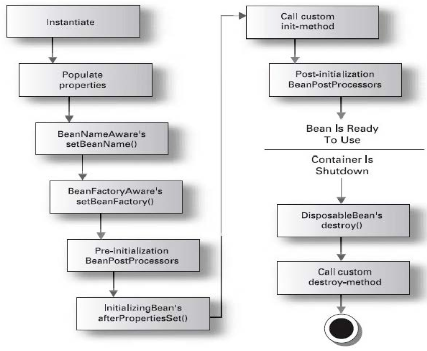

# Spring的Bean管理
## XML配置
### 三种实例化Bean的方式
- 使用类构造器实例化（默认无参数）
- 使用静态工厂方法实例化（简单工厂模式）
- 使用实例工厂方法实例化（工厂方法模式）

示例：package com.spring.example.bean.instantiation;
- Bean1：无参构造方法
- Bean2Factory：Bean2的静态工厂
- Bean3Factory：Bean3的实例工厂

XML配置文件：spring-bean.xml

## Bean的常用配置
- id和name
    - 一般情况下，装配一个Bean时，通过指定一个id属性作为Bean的名称
    - id属性在IOC容器中必须是唯一的
    - 如果Bean的名称中含有特殊字符，就需要使用name属性
- class
    - class用于设置一个类的完全路径名称，主要作用是IOC容器生成类的实例
- scope
    - 用于设定 Bean 实例的作用域，其属性值有 singleton（单例）、prototype（原型）、request、session 和 global Session。其默认值是 singleton
- constructor-arg
    - <bean>元素的子元素，可以使用此元素传入构造参数进行实例化。该元素的 index 属性指定构造参数的序号（从 0 开始），type 属性指定构造参数的类型
- property
    - <bean>元素的子元素，用于调用 Bean 实例中的 Set 方法完成属性赋值，从而完成依赖注入。该元素的 name 属性指定 Bean 实例中的相应属性名
- ref
    - <property> 和 <constructor-arg> 等元素的子元索，该元素中的 bean 属性用于指定对 Bean 工厂中某个 Bean 实例的引用
- value
    - <property> 和 <constractor-arg> 等元素的子元素，用于直接指定一个常量值
- list
    - 用于封装 List 或数组类型的依赖注入
- set
    - 用于封装 Set 类型属性的依赖注入
- map
    - 用于封装 Map 类型属性的依赖注入
- entry
    - <map> 元素的子元素，用于设置一个键值对。其 key 属性指定字符串类型的键值，ref 或 value 子元素指定其值

### Bean的作用域（Scope）
|类别|说明|
|:---|:---|
|singleton|在SpringIOC容器中仅存在一个Bean实例，Bean以单实例的方式存放|
|prototype|每次调用getBean()时都会返回一个新的实例|
|request|每次HTTP请求都会创建一个新的Bean，该作用域仅适用于WebApplicationContext环境|
|session|同一个HTTP Session共享一个Bean，不同的HTTP Session使用不同的Bean。该作用域仅适用于WebApplicationContext环境|

## Bean的生命周期
Spring初始化bean或销毁bean时，有时需要做一些处理工作，因此spring可以在创建和销毁bean的时候调用bean的两个生命周期的方法
```
<bean id="xxx" calss="xxxx.xxxx.xxx" init-method="init" destory-method="destory"/>
```
- 当bean被载入到容器的时候调用init
- 当bean从容器中删除的时候调用destory(scope=singleton有效，多例时不知道需要销毁哪个则无效)

### 生命周期的完整过程

1. instantiate bean对象实例化
2. populate properties 封装属性
3. 如果Bean实现BeanNameAware执行`setBeanName`
4. 如果Bean实现BeanFactoryAware或者ApplicationContextAware设置工厂`setBeanFactory`或者上下文对象`setApplicationContext`
5. 如果存在类实现BeanPostProcessor(后处理Bean)，执行`postProcessBeforeInitialization`
6. 如果Bean实现InitializingBean执行`afterPropertiesSet`
7. 调用<bean init-method="init">指定初始化方法`init`
8. `如果存在类实现BeanPostProcessor(处理Bean)，执行postProcessAfterInitialization`
9. 执行业务处理
10. 如果Bean实现DisposableBean执行`destroy`
11. 调用<bean destroy-method="customerDestory">指定销毁方法`customerDestory`

### beanpostprocessor的作用
beanpostprocessor 类可以在生成类的过程当中，对类产生代理，并可以对类中的方法进行增强。

## Spring的属性注入
- 对于类成员变量，注入方式有三种
    - 构造函数注入
    - 属性setter方法注入
    - 接口注入（Spring不支持）
### 构造方法注入
- 通过构造方法注入Bean的属性值或依赖的对象，它保证了Bean实例在实例化后就可以使用
- 构造器注入在<constructor-arg>元素里声明的属性
### set方法注入
- 使用set方法注入，在spring配置文件中，通过<property>设置注入的属性
### p名称空间
- 使用p命名空间
- 为了简化XML文件配置，Spring从2.5开始引入一个新的p名称空间
- p:<属性名>="xxx"引入常量
- p:<属性名>-ref="xxx"引用其它Bean对象
### SpEL注入
- SpEL：spring expression language, spring表达式语言，对依赖注入进行简化
- 语法：#{表达式}
- 示例：```<bean id="" value="#{表达式}">```

```
SpEL表达式语言
语法：#{}
#{'hello'}:使用字符串
#{beanId}:使用另一个bean
#{beanId.content.toUpperCase()}:使用指定名属性，并使用方法
#{T(java.lang.Math).PI}:使用静态字段或方法
```
### 复杂类型的属性注入
- 数组类型的属性注入
- List集合类型的属性注入
- Set集合类型的属性注入
- Map集合类型的属性注入
- Properties类型的属性注入

示例：package com.spring.example.bean.injection; AND package com.spring.example.bean.collection;

## 注解
### 使用注解定义Bean
- Spring2.5引入使用注解去定义Bean
    - @Component 描述Spring框架中Bean
- 除了@Component外，Spring提供了3个功能基本和@Component等效的注解
    - @Repository 用于对DAO实现类进行标注
    - @Service 用于Service实现类进行标注
    - @Controller 用于对Controller实现类进行标注
    - 这三个注解是为了让标注类本身的用途清晰，Spring在后续版本会对其增强

### Spring的属性注入-注解方式
- 使用@Autowired进行自动注入
- @Autowired默认按照类型进行注入
    - 如果存在两个相同Bean类型，则按照名称注入
- @Autowired注入时可以针对成员变量或者set方法
- 通过@Autowired的required属性，设置一定要找到匹配的Bean
- 使用@Qualifier指定注入Bean的名称
- Spring提供对JSR-250中定义@Resource标准注解的支持
- @Resource和@Autowired注解功能相似

### Spring的其他注解
#### Bean的生命周期
Spring初始化bean或销毁bean时，有时需要做一些处理工作，因此spring可以在创建和销毁bean的时候调用bean的两个生命周期的方法
```
<bean id="xxx" calss="xxxx.xxxx.xxx" init-method="init" destory-method="destory"/>
```
- 当bean被载入到容器的时候调用init，注解方式：**@PostConstruct** 初始化
- 当bean从容器中删除的时候调用destory(scope=singleton有效，多例时不知道需要销毁哪个则无效)，注解方式：**@PreDestroy** 销毁
#### Bean的作用范围
- 使用注解配置的Bean和<bean>配置的一样，默认作用范围都是singleton
- **@Scope**注解用于指定Bean的作用范围

### 传统XML配置和注解配置混合使用
- XML方式的优势
    - 结构清晰，易于阅读
- 注解方式的优势
    - 开发便捷，属性注入方便
- XML与注解的整合开发
    - 1、引入context命名空间
    - 2、在配置文件中添加context:annotation-config标签