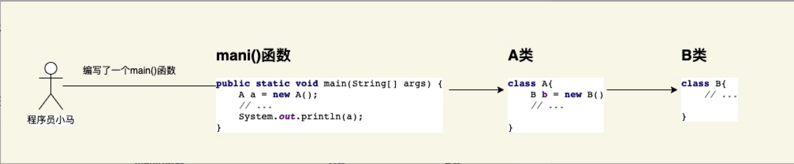
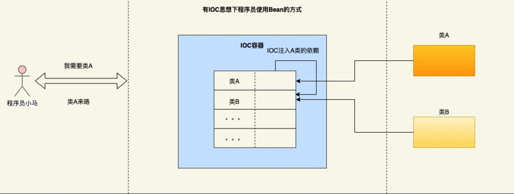
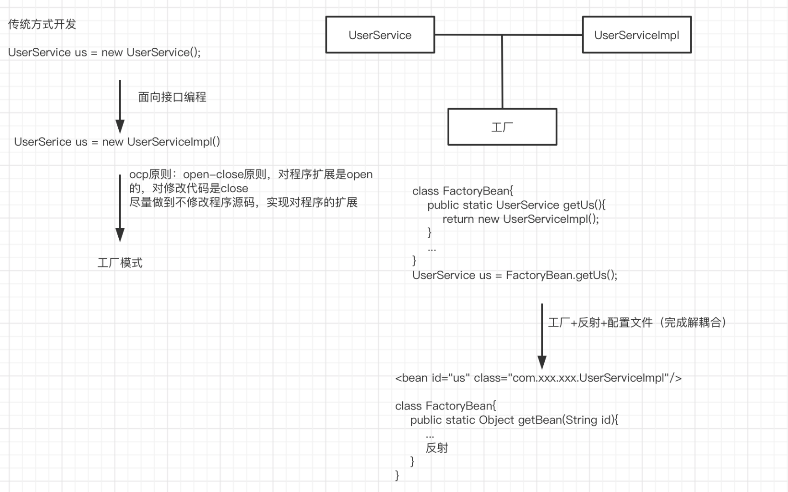
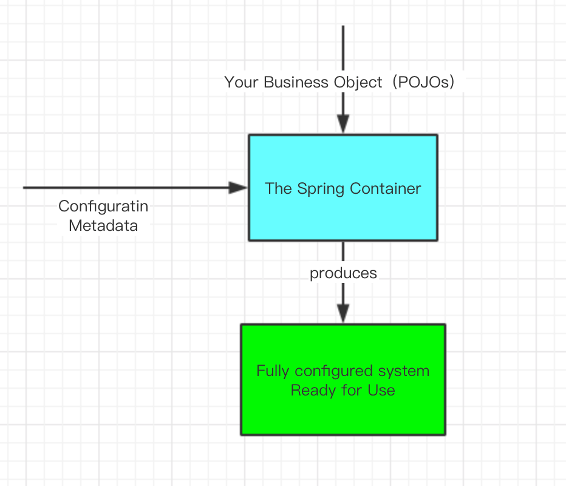
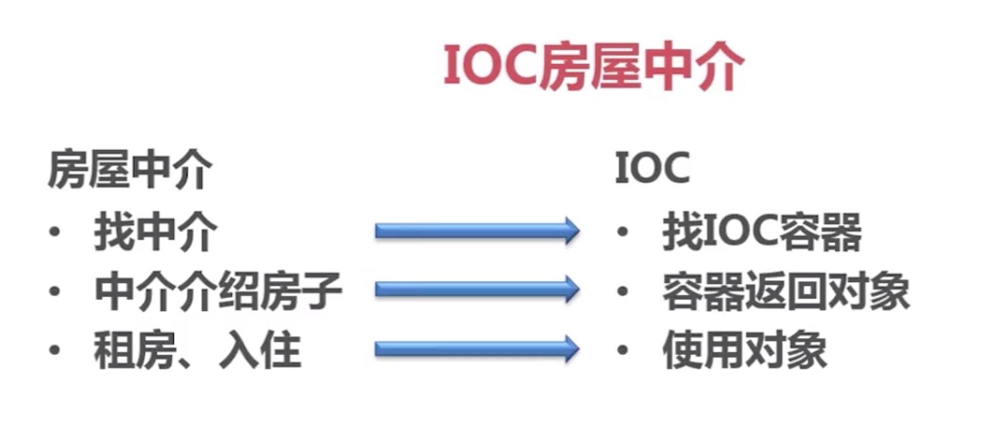
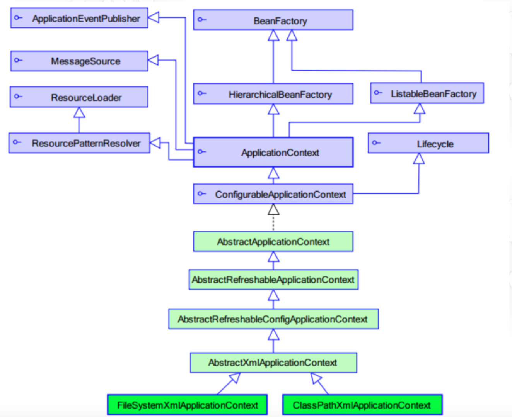

# IOC
## Bean管理
### 传统思想
- Bean之间的依赖关系如何体现

    - 程序员对A（对象）进行了主动的使用（new）创建了A类，A类中又依赖了B类，然后在对B类进行创建
    - 创建对象的权利限制是在程序员手上，需要哪个类就会对哪个类进行创建
    - B类是由程序员调用了A类有对B类的依赖随着而创建
    - 总之就是自动动手丰衣足食，没有借助任何中间产物
- 优点
    - 简单，需要什么就创建什么，从程序员角度上也是比较直观容易理解
- 缺点
    - Bean之间的协调关系是由程序内部代码来控制，即通过New关键字与我们的业务代码进行了强耦合
    - 对Bean没有进行统一的管理和配置 
### IOC思想
首先在这里强调一下IOC不是Spring提出来了，在Spring之前就已经有人提出了IOC思想，只不过在Spring之前都是偏理论化没有一个具体的落地方案，Spring在技术层面把IOC思想体现的淋漓尽致。
#### 什么是 IOC(Inversion of controller)
- IOC 是一种思想，而不是一个技术的实现
- 主要的描述是在软件开发的领域对象的创建和管理的问题


从上图可知:

- 程序员只需要告诉IOC自己需要那个Bean。就不需要关系该Bean创建的细节已经该Bean的相关依赖。这一切IOC容器已经帮你做好了。
- 凡事有得必有失: 这个过程中我们失去了创建Bean的权利。

## 控制反转
在理解控制反转之前我们首先要清楚控制是指什么？ 反转又反转了什么？

- **控制**: 指的就是我们上述说的我们失去的权利(创建对象的创建，或者说控制对象的权利)
- **反转**: 指的是控制权的转变。在没有 IOC 的容器上我们程序员想创建谁就创建谁的权利。在 IOC 容器下程序员就只能委屈巴巴的向 IOC 容器索取对象。创建对象的权利由程序员到 IOC 容器手里了。

## IOC 解决了什么问题？
- 其实就是解决了对象之间的耦合问题。
- 我们不需要在通过New关键字来创建对象，而是从容器中获取达到一种松耦合的目的。
- 同时IOC容器也方便管理容器内的所有Bean对象。所谓的Bean的生命周期。

## IOC和DI的区别
将到 IOC 肯定会有人想到 DI(Dependancy Injection)依赖注入，那这两者有什么不同和相同呢？

### 相同点
IOC 和 DI 描述的都是同一件事情(对象的实例化以及维护对象与对象已经的依赖关系)

### 不同点
- 首先IOC是一种思想，而DI是一种具体的技术实现手段。
- IOC是站着对象的角度上对象的实例化以及管理从程序员的手里交给了IOC容器
- DI是站着容器的角度的上会把对象的依赖的其他对象注入到容器中，上述案例中的A类依赖B类IOC容器不仅仅将A类放到容器中还需要将其依赖的B类也一并加载到IOC容器中。

## 接口及面向接口编程
### 接口
- 用于沟通的中介物的抽象化
- 实体把自己提供给外界的一种抽象化说明，用以由内部操作分离出外部沟通方法，使其能被修改内部而不影响外界其他实体与其交互的方式
- 对应Java接口即声明，声明了哪些方法是对外公开提供的
- 在Java8中，接口可以拥有方法体

## 面向接口编程
- 结构设计中，分清层次及调用关系，每层只向外层（上层）提供一组功能接口，各层间仅依赖接口而非实现类
- 接口实现的变动不影响各层间的调用，这一点在公共服务中尤为重要
- "面向接口编程"中的"接口"是用于隐藏具体实现和实现多态性的组件

## 简单的面向接口的例子

传统方式与IOC比较

Package:ioc.interfaces

## 什么是IOC
- Spring 容器是 Spring 框架的**核心**。
- 容器将创建对象，把它们连接在一起，配置它们，并管理他们的整个生命周期从创建到销毁。
- Spring 容器使用依赖注入（DI）来管理组成一个应用程序的组件。这些对象被称为 Spring Beans。

**IOC容器**具有依赖注入功能的容器，它可以创建对象，IOC 容器负责实例化、定位、配置应用程序中的对象及建立这些对象间的依赖。通常new一个实例，控制权由程序员控制，而"控制反转"是指new实例工作不由程序员来做而是交给Spring容器来做。在Spring中BeanFactory是IOC容器的实际代表者

**IOC:控制反转**，控制权的转移，应用程序本身不负责依赖对象的创建和维护，而是由外部容器负责创建和维护

**DI(依赖注入)**是其一种实现方式

**目的**：创建对象并且组装对象之间的关系

## 一个例子说明
- IOC Inverse of Control反转控制的概念，就是将原本在程序中手动创建UserService对象的控制权，交由Spring框架管理
- 简单说，就是创建UserService对象控制权被反转到了Spring框架
- DI Dependency Injection依赖注入的概念，就是在Spring创建这个对象的过程中，将这个对象所依赖的属性注入进去

The Spring IoC container


IOC房屋中介


## Spring工厂类


## Spring IOC需要的依赖
pom.xml
```
<dependency>
    <groupId>org.springframework</groupId>
    <artifactId>spring-core</artifactId>
    <version>5.0.0.RELEASE</version>
</dependency>
<dependency>
    <groupId>org.springframework</groupId>
    <artifactId>spring-expression</artifactId>
    <version>5.0.0.RELEASE</version>
</dependency>
<dependency>
    <groupId>org.springframework</groupId>
    <artifactId>spring-context</artifactId>
    <version>5.0.0.RELEASE</version>
</dependency>
<dependency>
    <groupId>org.springframework</groupId>
    <artifactId>spring-beans</artifactId>
    <version>5.0.0.RELEASE</version>
</dependency>
```

## Spring的Bean配置
- Spring中的配置方式
```
<?xml version="1.0" encoding="UTF-8"?>
<beans xmlns="http://www.springframework.org/schema/beans"
       xmlns:xsi="http://www.w3.org/2001/XMLSchema-instance"
       xsi:schemaLocation="http://www.springframework.org/schema/beans
        http://www.springframework.org/schema/beans/spring-beans.xsd">

    <bean id="oneInterface" class="com.spring.example.ioc.interfaces.impl.OneInterfaceImpl"></bean>

</beans>
```
- 例子
    - test下的Package：ioc.interfaces
    
## Bean容器初始化
- 基础：两个包
    - org.springframework.beans
    - org.springframework.context
    - BeanFactory提供配置结构和基础功能，加载并初始化Bean
    - ApplicationContext保存了Bean对象并在Spring中被广泛使用
- 方式，ApplicationContext
    - 本地文件
    ```
    ApplicationContext context = new FileSystemXmlApplicationContext("/Users/apple/WorkProject/SpringExample/src/main/resources/beans.xml");
    ```
    - Classpath
    ```
    ClassPathXmlApplicationContext context = new ClassPathXmlApplicationContext("classpath:beans.xml");
    ```
    - Web应用中依赖servlet或Listener
    ```
    <listener>
        <listener-class>org.springframework.web.context.ContextLoaderListener</listener-class>
    </listener>
    <servlet>
        <servlet-name>context</servlet-name>
        <servlet-class>org.springframework.web.context.ContextLoaderServlet</servlet-class>
        <load-on-startup>1</load-on-startup>
    </servlet>
    ```
    
## Spring注入
- Spring注入是指在启动Spring容器加载bean配置的时候，完成对变量的赋值行为
- 常用的两种注入方式（injection注入）
    - 设值注入
    ```
    <?xml version="1.0" encoding="UTF-8"?>
    <beans xmlns="http://www.springframework.org/schema/beans"
           xmlns:xsi="http://www.w3.org/2001/XMLSchema-instance"
           xsi:schemaLocation="http://www.springframework.org/schema/beans
            http://www.springframework.org/schema/beans/spring-beans.xsd">
    
        <!--设置注入-->
        <bean id="injectionService" class="com.spring.example.ioc.injection.service.InjectionServiceImpl">
            <property name="injectionDAO" ref="injectionDAO" />
              <!--name的值必须要与setter方法中参数的值一致-->
        </bean>
    
        <bean id="injectionDAO" class="com.spring.example.ioc.injection.dao.InjectionDAOImpl"></bean>
    
    </beans>
    ```
    - 构造注入
    ```
    <?xml version="1.0" encoding="UTF-8"?>
    <beans xmlns="http://www.springframework.org/schema/beans"
           xmlns:xsi="http://www.w3.org/2001/XMLSchema-instance"
           xsi:schemaLocation="http://www.springframework.org/schema/beans
            http://www.springframework.org/schema/beans/spring-beans.xsd">
    
        <bean id="injectionService" class="com.spring.example.ioc.injection.service.InjectionServiceImpl">
            <constructor-arg name="injectionDAO" ref="injectionDAO" ></constructor-arg>
            <!--name的值必须要与构造器参数的值一致-->
        </bean>
    
        <bean id="injectionDAO" class="com.spring.example.ioc.injection.dao.InjectionDAOImpl"></bean>
    
    </beans>
    ```
- 例子
    - Package:ioc.injection